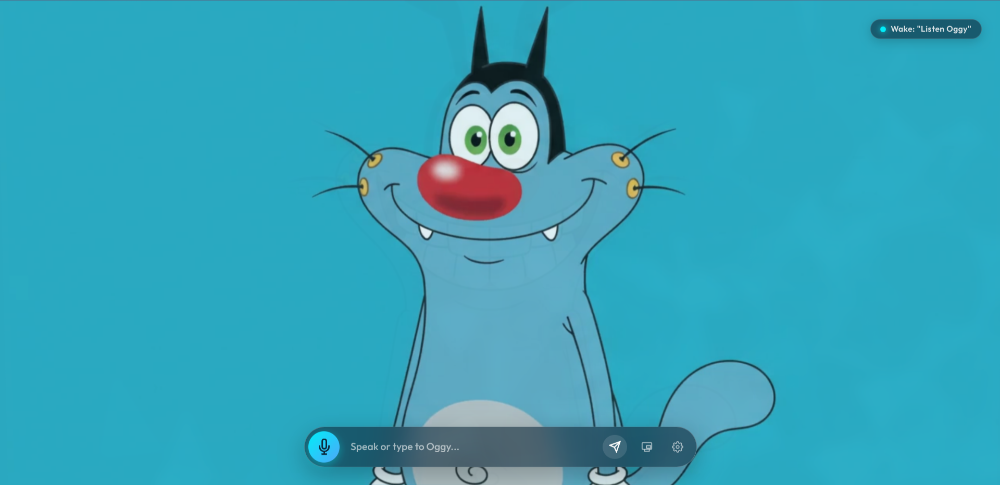
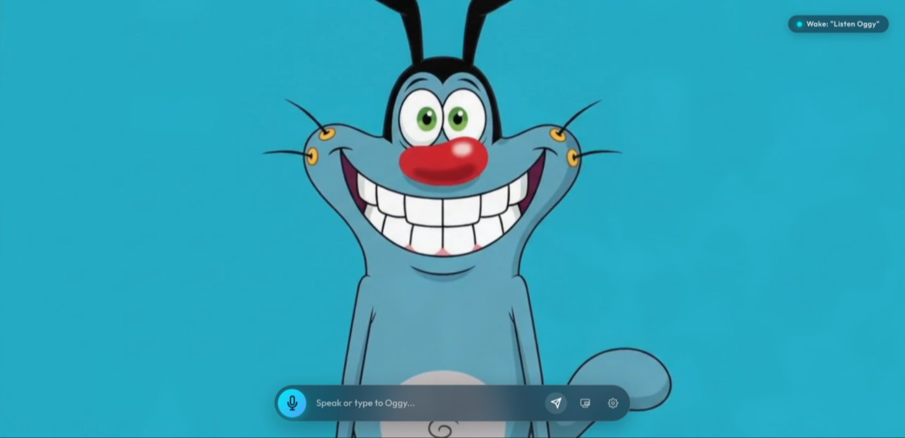

# ⚡ OGGY X — Interactive Cartoon AI Voice Assistant

<p align="center">
  
</p>

<p align="center">
  <b>A real-time, responsive full-screen cartoon AI voice assistant / Live Agent web application featuring OGGY X from <i>Oggy and the Cockroaches</i>.</b>
</p>

<p align="center">
  
  
  
  
</p>

---

## 📸 Screenshots

| **Interactive Voice Assistant Interface** | **Animated Expressive Character Reaction** |
|:---:|:---:|
|  |  |
| *Real-time speech input, audio visualizer, and wake word indicator* | *Dynamic facial expressions and video crossfade reactions* |

---

## ✨ Key Features

- **🎭 Dual-Buffer Video Crossfader**: Seamless character animation transitions (Idle, Listening, Thinking, Speaking, Expressive Reactions) with zero flicker or black screens.
- **👀 Interactive 3D Cursor Parallax**: Oggy dynamically tilts his head, body, and gaze in 3D (`perspective`, `rotateX`, `rotateY`) following your mouse cursor across the screen.
- **🎙️ Voice & Hands-Free Wake Word**: One-click microphone interaction using the Web Speech API with an active wake-word toggle (*"Listen Oggy"*).
- **🔊 Expressive Cartoon Voice**: Natural cartoon-style voice synthesis generated via `edge-tts` with an instant browser fallback.
- **🧠 Hybrid Offline/Online Intelligence**:
  - **Instant Offline Responses**: Curated knowledge base for cockroach lore (Joey, Dee Dee, Marky), cousin Jack, jokes, witty banters, and clock/calendar info.
  - **Google Gemini Fallback (Optional)**: Automatically falls back to Gemini 2.5 Flash for open-ended questions when an API key is provided.
- **🚀 Local App Launcher**: Launch desktop utilities (Calculator, Terminal, Web Browser, Files) directly using natural voice or text commands.
- **🌊 Live Audio Visualizer**: Pulsing audio frequency bars during listening and speaking states.

---

## 🚀 Getting Started

### Prerequisites

- **Python 3.10+**
- Modern Web Browser (Google Chrome, Microsoft Edge, Brave, or Firefox)
- Microphone enabled in your browser for voice interaction

### 1. Clone the Repository

```bash
git clone https://github.com/<your-username>/oggy-x-assistant.git
cd oggy-x-assistant
```

### 2. Quick Start (Automatic Setup)

Run the included startup script, which automatically configures the Python virtual environment and dependencies:

```bash
chmod +x start.sh
./start.sh
```

### 3. Manual Setup (Alternative)

If you prefer to install dependencies manually:

```bash
# Create and activate a virtual environment
python3 -m venv .venv
source .venv/bin/activate

# Install required packages
pip install -r requirements.txt

# Start the application server
python server.py
```

### 4. Open in Browser

Once the server is running, navigate to:

```
http://localhost:8000
```

---

## 💬 How to Interact

### 🎙️ Voice Interaction
- Click the **Microphone button** in the bottom HUD or say the wake phrase: `"Listen Oggy"`.
- Speak naturally into your microphone. Oggy will listen, reflect, and speak back with matching animations.

### ⌨️ Text Interaction
- Type any question or command into the input bar at the bottom and press `Enter` or click the Send button.

### 🎯 Example Voice & Text Commands

| Command | Action |
|:---|:---|
| *"Who are you?"* | Oggy introduces himself in his iconic comedic persona |
| *"Where are Joey, Dee Dee, and Marky?"* | Hilarious stories about the pesky cockroaches |
| *"Tell me a joke"* | Cartoon jokes and puns |
| *"What time is it?"* | Speaks real-time local time and date |
| *"Open calculator"* | Launches your local system calculator |
| *"Open browser"* | Launches your default web browser |
| *"Open terminal"* | Launches your local terminal |

---

## 🛠️ Adding Custom Answers & Skills

You can easily extend Oggy's offline knowledge base by editing [`knowledge_base.py`](knowledge_base.py).

Add new triggers and responses to the `FEED_QA` list:

```python
{
    "patterns": [r"\b(who made you|your creator)\b"],
    "keywords": ["creator", "who made you"],
    "answers": [
        "I was created with love and code to be your favorite cartoon voice assistant!",
        "A brilliant developer brought me to life right here!"
    ],
    "emotion": "smile",
    "video_style": "speaking_talk"
}
```

The server automatically supports reloading upon saving changes.

---

## 🔑 Optional: Google Gemini AI Integration

OGGY X works **100% offline out-of-the-box** for all built-in queries. To allow Oggy to answer any arbitrary question using Google Gemini AI:

1. Click the **Settings (⚙️)** icon on the bottom right of the web interface.
2. Enter your **Google Gemini API Key** and click Save.
3. *Alternative:* Set the `GEMINI_API_KEY` environment variable in your terminal:
   ```bash
   export GEMINI_API_KEY="your-api-key-here"
   ```

---

## 📁 Project Structure

```
oggy-x-assistant/
├── server.py              # FastAPI Web & REST Server
├── assistant_service.py   # Query router, edge-tts engine, and Gemini handler
├── knowledge_base.py      # Offline Q&A database and app launcher triggers
├── requirements.txt       # Python dependencies
├── start.sh               # One-click startup script
├── static/
│   ├── index.html         # Main full-screen user interface
│   ├── style.css          # Visual styling, HUD, glowing auras, and themes
│   ├── app.js             # Parallax tracking, STT/TTS coordination, audio FX
│   ├── oggy-x.png         # Logo icon
│   ├── screenshot-1.png   # Main assistant interface preview
│   ├── screenshot-2.png   # Character reaction preview
│   └── videos/            # Animated loop videos for different states
└── config.json            # Local configuration (e.g., API key)
```

---

## 🧰 Tech Stack

- **Backend**: Python 3, [FastAPI](https://fastapi.tiangolo.com/), [Uvicorn](https://www.uvicorn.org/), [edge-tts](https://github.com/rany2/edge-tts), [HTTPX](https://www.python-httpx.org/)
- **Frontend**: HTML5, Modern CSS3 (Flexbox/Grid, 3D Transforms), Vanilla JavaScript (Web Speech API, Web Audio API, Canvas)
- **AI / LLM**: Google Gemini 2.5 Flash (*optional fallback*)

---

## 📄 License

This project is licensed under the [MIT License](LICENSE).
